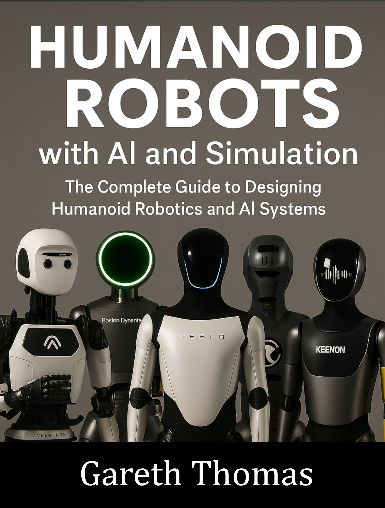

# Humanoid Robots With Ai And Simulation

### Cover

### Repository Structure
- `covers/`: Book cover images
- `blurbs/`: Promotional blurbs
- `infographics/`: Marketing visuals
- `source_code/`: Code samples
- `manuscript/`: Drafts and format.txt for TOC
- `marketing/`: Ads and press releases
- `additional_resources/`: Extras

View the live site at [burstbookspublishing.github.io/humanoid-robots-with-ai-and-simulation](https://burstbookspublishing.github.io/humanoid-robots-with-ai-and-simulation/)
---

## Chapter 1. Introduction to Robotics and NVIDIA Tools
### Section 1. The Evolution of Robotics
- History of robotics
- Modern trends in robotics
- Rise of humanoid robots
- Ethical and societal implications

### Section 2. NVIDIA Robotics Ecosystem
- Overview of Isaac Sim
- Introduction to GROOT for Behavior Trees
- Role of Omniverse in robotics
- Key features of NVIDIA SDK

### Section 3. Preparing Your Development Environment
- System requirements
- Installing Isaac Sim and SDK
- Setting up GROOT and Omniverse
- First steps: Running a simulation example

---
## Chapter 2. Anatomy of Humanoid Robots
### Section 1. Mechanical Anatomy
- Skeletal structure of humanoid robots
- Actuators and their applications
- Degrees of freedom in humanoid robots
- Challenges in humanoid balance

### Section 2. Electrical Components
- Sensors and their placement
- Power systems: Batteries vs wired
- Microcontrollers and processors
- Communication systems

### Section 3. Integration of Mechanical and Electrical Systems
- Synchronization challenges
- Designing for efficiency
- Maintenance considerations
- Troubleshooting common issues

---
## Chapter 3. Fundamentals of Mechanical Design
### Section 1. Tools for Mechanical Design
- CAD software overview
- Using Omniverse for mechanical simulation
- Practical design tips for humanoids
- Case study: Building a robotic hand

### Section 2. Materials and Fabrication
- Structural materials for robotics
- 3D printing and CNC machining
- Balancing strength and flexibility
- Environmental considerations

### Section 3. Assembly and Testing
- Assembling mechanical components
- Stress testing the framework
- Troubleshooting mechanical faults
- Real-world challenges in assembly

---
## Chapter 4. Electrical Engineering for Robotics
### Section 1. Power Systems
- Choosing a power source
- Managing battery life
- Safety in electrical design
- Testing and monitoring power systems

### Section 2. Sensor Integration
- Types of sensors (vision, IMUs, etc.)
- Sensor calibration techniques
- Data acquisition and processing
- Real-world case study: Obstacle detection

### Section 3. Control Systems
- Basics of motor control
- Closed-loop vs open-loop systems
- Real-time data processing
- Challenges in humanoid motion control

---
## Chapter 5. Software Fundamentals
### Section 1. Introduction to Robotics Operating Systems
- Overview of ROS and ROS2
- Setting up ROS for humanoid robots
- Basic ROS nodes and topics
- Debugging with ROS tools

### Section 2. Behavior Tree Basics
- Fundamentals of decision-making in robotics
- Creating Behavior Trees in GROOT
- Debugging and optimizing trees
- Advanced patterns in tree design

### Section 3. Integrating Software and Hardware
- Real-time control with ROS
- Communicating with sensors and actuators
- Synchronization challenges
- Best practices in system integration

---
## Chapter 6. Training Humanoids in Simulation
### Section 1. Isaac Sim Fundamentals
- Setting up simulation environments
- Building virtual twins
- Physics-based simulation features
- Debugging simulation issues

### Section 2. Data Collection and Training
- Generating synthetic training data
- Training perception models
- Reinforcement learning basics
- Evaluating model performance

### Section 3. Transitioning to Real Robots
- Transferring trained models
- Bridging the simulation-reality gap
- Testing in real-world conditions
- Continuous training cycles

---
## Chapter 7. Perception and Vision Systems
### Section 1. Fundamentals of Computer Vision
- Object detection and classification
- Depth perception and stereo vision
- Key challenges in visual processing

### Section 2. Integrating Vision with Robotics
- Vision sensors and hardware
- Building vision pipelines
- Case study: Gesture recognition

### Section 3. Advanced Vision Techniques
- Semantic segmentation
- Visual SLAM for humanoids
- Using pretrained models
- Future trends in robotic vision

---
## Chapter 8. Motion Planning and Control
### Section 1. Basics of Motion Control
- Understanding kinematics and dynamics
- Balancing algorithms
- Case study: Humanoid walking

### Section 2. Advanced Motion Planning
- Pathfinding algorithms
- Reactive vs proactive planning
- Collision avoidance techniques

### Section 3. Optimization and Challenges
- Improving efficiency in motion
- Handling unexpected obstacles
- Scaling motion planning to complex tasks
- Common pitfalls in humanoid control

---
## Chapter 9. Advanced Behavior Design
### Section 1. Extending Behavior Trees
- Complex tree structures
- Hybrid approaches to decision-making
- Case study: Multi-task robots

### Section 2. Collaboration and Teamwork
- Multi-robot coordination
- Implementing swarm intelligence
- Case study: Collaborative humanoids

### Section 3. Ethical Behavior in Robotics
- Decision-making constraints
- Avoiding unintended behaviors
- Regulatory and ethical considerations

---
## Chapter 10. Human-Robot Interaction
### Section 1. Fundamentals of HRI
- Understanding human factors
- Designing intuitive interactions
- Case study: Voice-command robots

### Section 2. Advanced Interaction Methods
- Natural language processing in robotics
- Emotion recognition
- Gesture-based controls

### Section 3. Applications of HRI
- Robots in healthcare
- Educational humanoid systems
- Assistive robotics for disabilities

---
## Chapter 11. Autonomous Navigation
### Section 1. Basics of SLAM
- Understanding Simultaneous Localization and Mapping
- Mapping techniques for humanoids
- Sensor fusion for improved accuracy
- Case study: Indoor navigation

### Section 2. Path Planning Algorithms
- Graph-based methods (A*, Dijkstra's)
- Sampling-based methods (RRT, PRM)
- Hybrid approaches to pathfinding
- Real-world examples: Avoiding obstacles

### Section 3. Challenges in Navigation
- Handling dynamic environments
- Navigating uneven terrain
- Dealing with sensor noise
- Improving robustness and efficiency

---
## Chapter 12. Reinforcement Learning for Robotics
### Section 1. Fundamentals of Reinforcement Learning
- Key concepts: States, actions, rewards
- Exploration vs exploitation trade-offs
- Designing reward functions for robots
- Case study: Balancing a humanoid

### Section 2. Training Robots in Simulation
- Using Isaac Sim for RL environments
- Transferring learned behaviors to hardware
- Avoiding overfitting to simulation

### Section 3. Applications of RL
- Humanoid walking and running
- Object manipulation tasks
- Cooperative robotics using RL
- Future trends in RL for robotics

---
## Chapter 13. Collaborative Robotics
### Section 1. Introduction to Multi-Robot Systems
- Benefits of collaboration
- Designing communication protocols
- Task allocation strategies

### Section 2. Swarm Intelligence
- Fundamentals of swarm robotics
- Implementing decentralized control
- Case study: Multi-humanoid assembly task

### Section 3. Real-World Applications
- Collaborative robots in manufacturing
- Disaster response robotics
- Future of collaborative humanoid robots

---
## Chapter 14. Real-World Robotics Applications
### Section 1. Robots in Healthcare
- Assistive robots for elderly care
- Robots in surgery and rehabilitation
- Challenges in medical robotics

### Section 2. Robots in Education
- Teaching STEM with humanoid robots
- Interactive learning experiences
- Case study: Robots in classrooms

### Section 3. Robots in Industry
- Humanoids in logistics and warehousing
- Advanced manufacturing tasks
- Ethical and practical challenges

---
## Chapter 15. Debugging and Troubleshooting
### Section 1. Mechanical Troubleshooting
- Identifying common mechanical failures
- Best practices for maintenance
- Case study: Fixing actuator malfunctions

### Section 2. Software Debugging
- Debugging with ROS and GROOT
- Common software pitfalls in robotics
- Tools for performance analysis

### Section 3. Debugging Integration Issues
- Diagnosing communication errors
- Handling synchronization problems
- Testing in real-world environments

---
## Chapter 16. Ethics and Safety in Robotics
### Section 1. Ethical Implications of Humanoid Robots
- Privacy concerns with robots
- Impacts on employment and society
- Designing for inclusivity and fairness

### Section 2. Ensuring Safety in Robotics
- Safety protocols for humanoids
- Handling failures gracefully
- Best practices for safe operation

### Section 3. Regulatory Compliance
- Navigating global robotics regulations
- Certification processes for robots
- Case study: Meeting safety standards

---
## Chapter 17. Future Trends in Robotics
### Section 1. Advances in AI for Robotics
- Emerging AI models for control
- Integrating generative AI with robotics
- Case study: Predictive maintenance

### Section 2. Robotics in Space and Exploration
- Humanoids in space missions
- Challenges of robotic exploration
- Future possibilities for space humanoids

### Section 3. Emerging Applications
- Robots in entertainment and gaming
- Autonomous robots in agriculture
- Pushing the boundaries of humanoid design

---
## Chapter 18. Case Study: Building a Complete Humanoid Robot
### Section 1. Starting from Scratch
- Defining requirements and goals
- Planning the design and build process
- Managing costs and timelines

### Section 2. Step-by-Step Implementation
- Designing the mechanical structure
- Programming the control software
- Training the robot in simulation
- Testing and deploying the robot

### Section 3. Lessons Learned and Future Directions
- Challenges faced during development
- Optimizing for scalability
- Next steps in humanoid robotics
---
